&nbsp;

 &nbsp; &nbsp;

&nbsp;
&nbsp;

  

&nbsp;
&nbsp;

  

&nbsp;
&nbsp;

  

&nbsp;
&nbsp;

  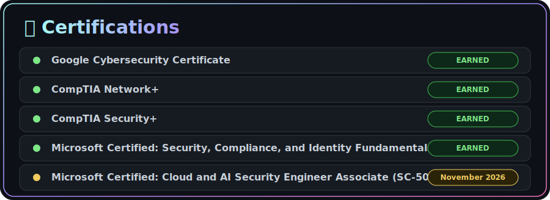

&nbsp;

  

  <a href="https://github.com/jarredward1/vulnerability-management-program"></a>
  <a href="https://github.com/jarredward1/disa-stig-remediations"></a>

  <a href="https://github.com/jarredward1/cybersecurity-risk-assessment">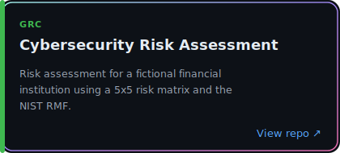</a>
  <a href="https://github.com/jarredward1/enterprise-security-program">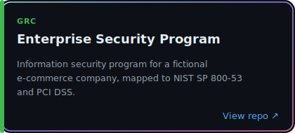</a>

  <a href="https://github.com/jarredward1/pci-dss-audit">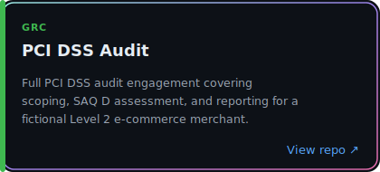</a>
  <a href="https://github.com/jarredward1/grc-analyst-project"></a>

  
  

  
  <a href="https://github.com/jarredward1/threat-hunts">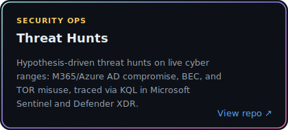</a>

  <a href="https://github.com/jarredward1/azure-soc"></a>
  <a href="https://github.com/jarredward1/claude-ask"></a>

&nbsp;
&nbsp;

  

  
  

  

&nbsp;
&nbsp;

  

  

  <picture>
    <source media="(prefers-color-scheme: dark)" srcset="https://raw.githubusercontent.com/jarredward1/jarredward1/output/github-contribution-grid-snake-dark.svg" />
    <source media="(prefers-color-scheme: light)" srcset="https://raw.githubusercontent.com/jarredward1/jarredward1/output/github-contribution-grid-snake.svg" />
    
  </picture>

&nbsp;
&nbsp;

  

  

  

